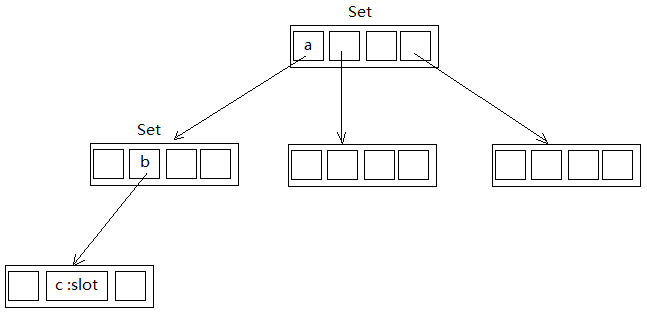

# Trie_Tree_Language  

 该Demo主要是基于字典树数据结构（见下图），工程中共建立两棵树：Slot树和Intent树  
 1.Slot树：存储完每个slot字符串（例如：感冒）后，在最后一个节点的位置指明对应的slot名字，例如：disease  
 2.Intent树：则是在存储完每一个对应规则顺序之后（例如： :body :feel），在最后一个节点位置指明对应的intent名字，例如： ::Symptom  
 从文件读入并存储这些规则之后，对输入的待检测文本进行搜索匹配即可。  
   
 工程共三个文件：  
 1.main.cc :主文件  
 2.trie_set_tree.cc :类的实现文件  
 3.trie_set_tree.h :类的头文件  
 4.规则文件在trie_set_tree目录下    
 
 
